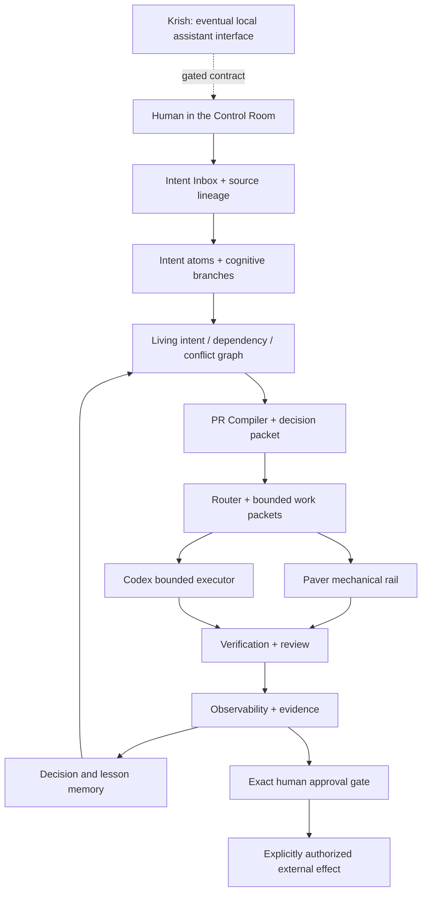

# Cognitive Development OS: the big vision

Status: living public specification, 2026-08-02

## North star

Cognitive Development OS is the control plane for turning ongoing human thought
into coherent, safe, verifiable progress.

The human should not have to stop thinking naturally in order to become a ticket
writer, task sequencer, agent dispatcher, or release manager. They should be able
to speak, type, question, explore, contradict themselves, and refine direction.
The system should preserve where every idea came from, distinguish exploration
from instruction, maintain the relationships among ideas, and prepare the next
coherent change only when the intent and evidence are ready.

The eventual experience is a human-facing **Control Room**:

- messy thought enters through conversation and voice;
- source and lineage remain inspectable;
- side questions branch without derailing the main goal;
- a living graph holds intent, dependencies, conflicts, decisions, and evidence;
- coherent graph cuts become bounded implementation plans;
- mechanical procedures run through verified rails, while open-ended work goes
  to bounded AI workers;
- verification and review determine what actually happened;
- consequential effects wait for exact human approval; and
- the system learns through evidence-backed lessons without silently expanding
  its authority.

The key product principle is:

> **Pull requests are an implementation detail, not the primary interface.**

The human supplies intent, judgment, taste, and approval. The system supplies
continuity, structure, sequencing, evidence, and carefully bounded execution.

## Honest scope today

This repository is not that finished Control Room yet. It contains a verified
local dry-run control-plane slice:

- exact local source capture in an append-only event ledger;
- conservative intent extraction and human confirmation boundaries;
- a restart-safe dependency, conflict, and cluster graph; and
- a PR Compiler that produces a dependency-closed plan and deep, draft-only
  execution brief.

[PR #13](https://github.com/CasterlyGit/cognitive-development-os/pull/13)
merged the end-to-end decision packet after review and combined verification.
[PR #14](https://github.com/CasterlyGit/cognitive-development-os/pull/14)
merged a versioned offline Krish handoff contract after separate review. Its
parser fails closed on type confusion, `live_enabled` remains false, and no
adapter exists. Neither PR enables external action.

The current product makes no network call, starts no background service, does
not access Krish, does not invoke Codex, and cannot create, push, merge, deploy,
message, purchase, or delete anything. The current models are typed and the
fixtures are synthetic. Those limitations are safety properties, not hidden
capabilities.

## The final system

### 1. The human-facing Control Room

The Control Room is a decision interface, not a wall of agent activity. It
should answer:

1. What does the system believe I want?
2. What changed, and where did that belief come from?
3. What conflicts, uncertainty, or dependency matters now?
4. What is the next coherent move, and why now?
5. What evidence exists, what decision is needed, and what remains blocked?

Conversation and voice are the natural front door. A structured issue or pull
request may still be useful for implementation, but the person should not need
to manufacture one before the system can understand the work.

### 2. Intent Inbox and lineage

Every meaningful input enters as immutable source before interpretation. The
system derives typed intent atoms while retaining exact provenance and marking
uncertainty rather than inventing certainty.

Source preservation does not mean indiscriminate retention. The finished
product needs explicit local retention, redaction, export, and deletion policy.
Private source stays private by default; public artifacts use synthetic or
redacted evidence.

### 3. Intent graph and branch-aware continuity

Human thought is neither a queue nor a single scroll. The system keeps a living
graph of goals, constraints, dependencies, conflicts, risks, product areas,
decisions, evidence, and superseded directions.

A side question creates a child branch anchored to a precise point. It inherits
only the context and permissions it needs, reads the parent by default, and
cannot rewrite the accepted path. Its result may be promoted, archived, or
discarded through an explicit event. Accepted intent and plan versions are
never silently rewritten, so restart and later continuation preserve meaning.

### 4. PR Compiler

The PR Compiler delays implementation until it can select the smallest coherent
graph cut that is dependency-complete, conflict-aware, testable, reviewable, and
reversible enough for its risk.

Its output is more than a title. It includes why the work exists, why it should
happen now, included and excluded intent, ordered dependencies, owned scope,
acceptance criteria, verification, risks, stop conditions, source provenance,
and permission boundary. Multiple pull requests should read as chapters in one
product evolution, not unrelated agent output.

### 5. Sidecar AI

Sidecar AI is the branch-aware interface to the same continuity model. A person
can ask for an explanation, challenge an assumption, inspect code, compare
options, or try a transformation without interrupting the primary goal.

The initial rule is simple: **read access by default; write back only by explicit
promotion**. Sidecar is planned as a product surface after the underlying branch
and plan-version semantics are proven. It is not present in the current code.

### 6. Graph Architect Workbench

The Workbench is the later read-and-design surface for the system's execution
graph: nodes, routes, evaluators, memory, human gates, retry edges, and failure
behavior. It should make the real control logic inspectable rather than show a
decorative animation of agents.

This is intentionally deferred until one fixed plan-execute-verify-learn loop
has strong evidence. Generalizing the graph before validating the fixed loop
would create framework complexity instead of product value.

### 7. Model and worker routing

Routing assigns cognitive work in proportion to its demands:

- **Sol** architects and arbitrates complex or cross-cutting decisions;
- **Terra High** performs the default bounded implementation work; and
- **Luna Low** handles routine status, formatting, and low-risk operations.

Those are current route defaults in compiler output, not a working dispatcher.
The finished router will classify work, explain its route, record cost and
outcome evidence, and escalate only when evidence warrants it. Routing can
change the worker; it can never expand permission.

### 8. Paver-backed mechanical execution

Repeatable procedures should become verified mechanical capabilities rather
than being rediscovered by an AI on every run. Paver is the intended mechanical
rail: it receives sanitized intent classes, executes only known capabilities,
enforces gates and quarantine, verifies outcomes, and records privacy-redacted
receipts.

When no verified mechanical capability applies, the router may prepare a
bounded Codex work packet. Successful repeated procedures can later be proposed
for mechanical promotion. Paver integration is planned; this repository does
not currently invoke it at runtime.

### 9. Codex as bounded executor

Codex is not the product being replaced and not the holder of ambient authority.
It is the implementation executor for a versioned brief with explicit objective,
scope, exclusions, evidence contract, verification, and stop conditions.

Execution must be idempotent where possible, preserve every failed attempt,
reconcile observed state after interruption, and stop on ambiguity, stale
approval, scope escape, or failed verification.

### 10. Verification, review, and learning

An executor saying "done" is a claim, not proof. The control plane compares the
requested outcome with observed evidence, routes appropriate review, preserves
failures, caps retries, and quarantines repeated unsafe or unreliable paths.

Lessons cite the runs and evidence that produced them. They begin as proposals,
remain reviewable if rejected, and require human promotion before becoming
policy. A lesson may improve planning or verification; it may never grant a
permission.

### 11. Observability and decision memory

Every run should expose a normalized timeline: source, interpretation, plan
version, route, attempt, evidence, failure, approval, effect, and lesson. A
restart should reconstruct the same accepted state, not merely the latest text
summary.

The Control Room should surface exceptions and decisions, not demand constant
supervision of atomic steps. Auditability means a person can trace any outcome
back to its source, plan, worker, evidence, approval, and external effect.

### 12. Krish's eventual role

Krish is the eventual local, human-facing personal assistant. Cognitive
Development OS is the planning, permission, review, and learning control plane
behind that experience. Codex remains a bounded implementation worker.

Krish integration is intentionally not active. It requires a versioned
contract, explicit identity and capabilities, separate creation and queueing,
idempotency, external-state reconciliation, stop/recovery behavior, approved
retention, exact effect receipts, and a mechanically human-only merge path. A
read-only proposal comes before any write capability, and every integration
step requires new explicit authorization.

## Capability ledger

This is the compact source of truth for major promises. **Implemented** means
verified code exists; a review-gated item is called out. **Planned** means it is
on the dependency path. **Deferred** means valuable but intentionally later.
**Rejected** means incompatible with the current safety model.

| Major concept | Status | Current evidence or completion trigger |
| --- | --- | --- |
| Local append-only source capture and restart | **Implemented** | Merged Layers 1-2; store and lifecycle tests cover exact source, provenance, replay, and fail-closed history. |
| Exploration/action distinction and human confirmation | **Implemented** | Merged intent lifecycle; system authority cannot confirm actionable intent. |
| Dependency/conflict/cluster graph | **Implemented** | Merged Layer 3 with cycle rejection and deterministic reconstruction. |
| Dry-run PR Compiler and bounded Codex brief | **Implemented** | Merged Layer 4; P1 draft-only and no executor invocation. |
| End-to-end decision packet | **Implemented** | [PR #13](https://github.com/CasterlyGit/cognitive-development-os/pull/13) merged the CI-verified local decision packet; it has no external-effect authority. |
| Cognitive branch core and immutable plan versions | **Implemented** | [PR #19](https://github.com/CasterlyGit/cognitive-development-os/pull/19) merged read-only children, exact atom/source lineage, human promotion, supersession, stale-state rejection, idempotent replay, restart tests, and a synthetic demo. It is not a live Sidecar. |
| Semantic extraction with confidence | **Implemented** | [PR #21](https://github.com/CasterlyGit/cognitive-development-os/pull/21) merged typed deterministic bands/scores/signals, hedged-action fallback to exploration, historical `unassessed` replay, and tests that confidence cannot confirm intent. It has no model/API inference. |
| Redacted structural lineage export | **Implemented** | [PR #23](https://github.com/CasterlyGit/cognitive-development-os/pull/23) merged deterministic scope-specific public references after validating exact local lineage; its schema has no raw source, statement, span, metadata, timestamp, content-hash, or local-ID field. |
| Atomic continuity stream revision | **Implemented** | [PR #25](https://github.com/CasterlyGit/cognitive-development-os/pull/25) merged exact projected-stream revision checks under the append lock, distinct-writer rejection without append, and exact-retry reconciliation. |
| Local retention, deletion, and archived-search policy | **Implemented — review gate** | Issue #26 / Stage 1E provides session-only defaults, bounded opt-in persistence, exact archived scope, reversible quarantine planning, and a privacy-safe audit. It does not yet enforce storage migration or deletion. |
| Multi-project intent field and relationship proposals | **Planned** | Requires evidence/confidence on every proposed edge and human conflict resolution. |
| Evidence-driven worker routing and Paver runtime rail | **Planned** | Requires mocked dispatch, receipts, telemetry, and proof that routing cannot expand permission. |
| Outcome verifier, review, observability, and lesson memory | **Planned** | Requires normalized attempts, independent evidence, retry caps, quarantine, timelines, and human-promoted lessons. |
| Human-facing Control Room and Sidecar AI | **Planned** | Requires branch semantics and decision-packet usability evidence first. |
| Effect-scoped approval receipts and adapter simulator | **Planned** | Must reject wrong target/digest/scope, expiry, revocation, replay, and stale state without network access. |
| Krish handoff contract | **Deferred — draft contract merged** | [PR #14](https://github.com/CasterlyGit/cognitive-development-os/pull/14) merged the validated contract while keeping live integration disabled. |
| Live Krish, GitHub, deployment, or Codex adapters | **Deferred** | Require the internal verification and permission stages plus new explicit authorization per capability. |
| General Graph Architect Workbench | **Deferred** | Revisit after a fixed verified execution/learning loop shows need for graph inspection or editing. |
| Automatic merge or unattended consequential action | **Rejected** | Merge remains mechanically human-only; exploration never implies authority. |
| Ambient access to every chat without a visible contract | **Rejected** | Conflicts with explicit identity, privacy, retention, and permission boundaries. |

## Dependency-aware roadmap

### Settled dry-run and contract gates

[PR #13](https://github.com/CasterlyGit/cognitive-development-os/pull/13) and
[PR #14](https://github.com/CasterlyGit/cognitive-development-os/pull/14) are
merged. The local decision packet and draft-only contract remain useful evidence,
not integration authority: `live_enabled` stays false, no adapter exists, and
no Krish authority is granted.

### Stage 1 — intent continuity and cognitive branches

This local Stage 1 path is implemented in merged, independently reviewable
slices:

- typed semantic confidence and safe fallback to exploration;
- parent/child branch anchors and inherited constraints;
- read-only child behavior with explicit promote, discard, and archive events;
- immutable accepted intent and plan versions with supersession;
- stale-decision rejection and restart reconstruction; and
- local retention, redaction, and public-export policy.

Acceptance requires typed models, degraded-path tests, a synthetic end-to-end
fixture, no external effects, and a reviewable decision packet showing a branch
that changes the proposed plan without rewriting its history.

[PR #19](https://github.com/CasterlyGit/cognitive-development-os/pull/19)
merged the first thin slice from [issue #18](https://github.com/CasterlyGit/cognitive-development-os/issues/18): the local branch, promotion, immutable
plan-version, stale-state, replay, and restart core.

[PR #21](https://github.com/CasterlyGit/cognitive-development-os/pull/21)
merged the next independently reviewable slice from [issue #20](https://github.com/CasterlyGit/cognitive-development-os/issues/20): typed confidence
for the local rules extractor, safe fallback for hedged action, and explicit
proof that confidence is metadata rather than authority. Learned/model-based
semantic inference remains outside this slice.

[PR #23](https://github.com/CasterlyGit/cognitive-development-os/pull/23)
merged the safe export portion of the privacy boundary from [issue #22](https://github.com/CasterlyGit/cognitive-development-os/issues/22): it
validates exact private lineage locally, then emits only structural typed state
and scope-specific pseudonymous references.

[PR #25](https://github.com/CasterlyGit/cognitive-development-os/pull/25)
merged hardening for the same local aggregate against validation/append races
from [issue #24](https://github.com/CasterlyGit/cognitive-development-os/issues/24). Each
command carries the stream revision observed with its projection into the locked
append; a distinct concurrent change becomes a retryable stale-state result,
while the same operation racing itself reconciles to the existing event.

[Issue #26](https://github.com/CasterlyGit/cognitive-development-os/issues/26)
implements the conservative policy/audit slice: session-only raw retention by
default, bounded and approved local persistence, exact archived search,
reversible exact-source quarantine planning, and single-project reasoning. Its
legacy audit truthfully shows that the current ledger still embeds private
fields, so Stage 1 storage enforcement remains incomplete until content is
separated from structural lineage.

### Stage 2 — the multi-project intent field

Add project identity and lifecycle, source-backed relationship proposals,
confidence, cross-project dependencies, conflict decisions, and coherent graph
cuts across a synthetic project set. The system must not scan unrelated
local storage, and cross-project reasoning must be opt-in at a defined scope.

### Stage 3 — bounded routing and execution graph

Add task/risk classification, route explanations, Sol/Terra/Luna escalation,
Paver capability lookup and receipts, and bounded Codex packet dispatch through
test doubles. No live external adapter is part of this stage. Tests must prove
that route choice cannot change owned scope or permission.

### Stage 4 — outcome verification, review, observability, and learning

Normalize attempts and evidence; compare claimed with observed outcomes; add
capped retry, quarantine, timelines, blocker decisions, decision memory, and
human-promoted lessons. A failing synthetic run must end in a transparent
blocker and lesson proposal without silently changing policy.

### Stage 5 — the Control Room and Sidecar surface

Build the smallest interface that makes source, branches, plans, evidence, and
decisions understandable. Validate one generic Sidecar before specialist buddy
roles. Optimize for decision clarity and continuity, not animated activity.

### Stage 6 — permission simulator and gated adapters

Prove exact effect receipts, capability discovery, idempotency, reconciliation,
expiry, revocation, and recovery in a no-network simulator. Then request a new
human decision for each read-only or write capability. GitHub issue creation,
queueing, merge, deployment, and Krish access remain separate permissions.

### Stage 7 — Krish and later workbench integration

Only after the earlier stages are robust should the project propose a read-only
Krish connection. Live code requires a new authorization and a mechanically
human-only merge gate. The general Graph Architect Workbench follows observed
need from the verified fixed graph, not speculation.

## Human decisions that cannot be inferred

The roadmap intentionally leaves these choices to a person:

- routing cost/risk thresholds and retry caps;
- the minimum evidence required for each risk class;
- plugin versus approved local service for Krish; and
- every capability that can cause an external effect.

These are material product or permission decisions. They should not be hidden
inside implementation PRs.

## Non-goals and safety invariants

- The system does not turn every thought into a task.
- Intent confirmation is not execution permission.
- Model confidence is not evidence and never grants authority.
- Routing changes workers, not permissions.
- Lessons cannot rewrite history or expand capability.
- A passing executor run is not proof of user outcome.
- Private transcripts and real recordings do not belong in public Git history.
- Restart and reconciliation must fail closed on ambiguity or corruption.
- Krish is not modified or accessed without a reviewed contract and new
  authorization.
- Merge remains human-only under the current product and safety model.

## How this specification governs progress

This document is a living public specification, not a one-time manifesto.

Every meaningful subsystem issue should cite one or more concepts here. Every
PR that changes a major promise should update the capability ledger or explain
why no status changes. Architecture decisions preserve consequential choices;
the [architecture index](ARCHITECTURE.md) describes current structure; the
[issue-based roadmap](ROADMAP.md) records live delivery order.

Progress is measured by moving concepts from **planned** or **deferred** to
**implemented** with typed models, degraded-path tests, a runnable synthetic
fixture, truthful documentation, and reviewable evidence—never by silently
shrinking the vision or claiming capabilities that do not exist.
